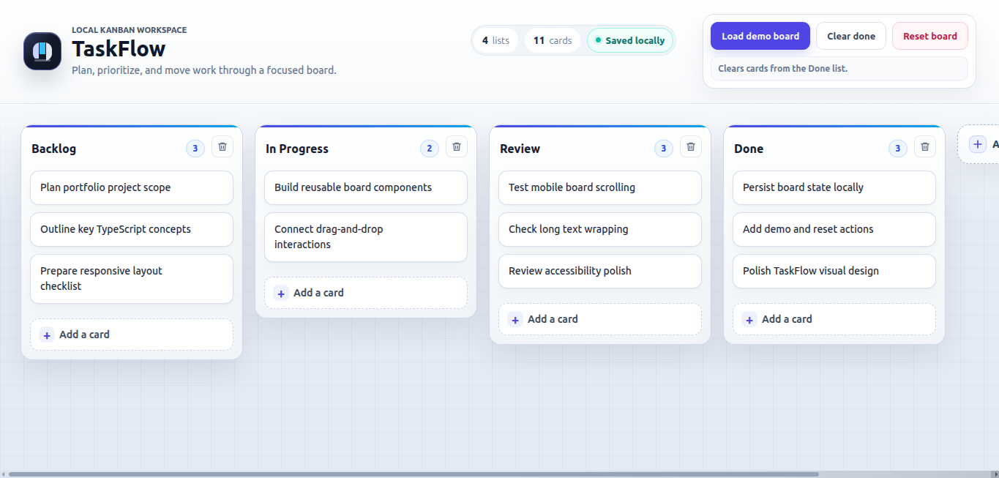
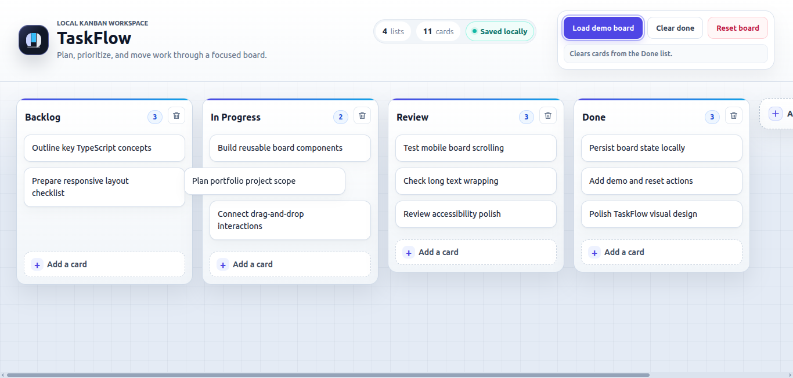
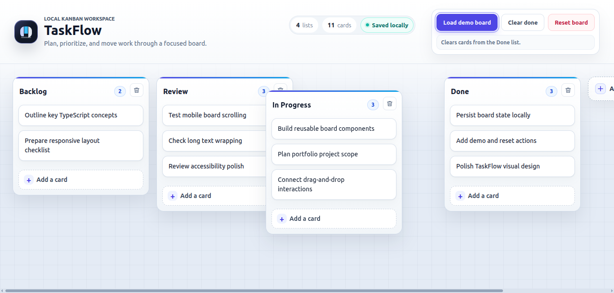
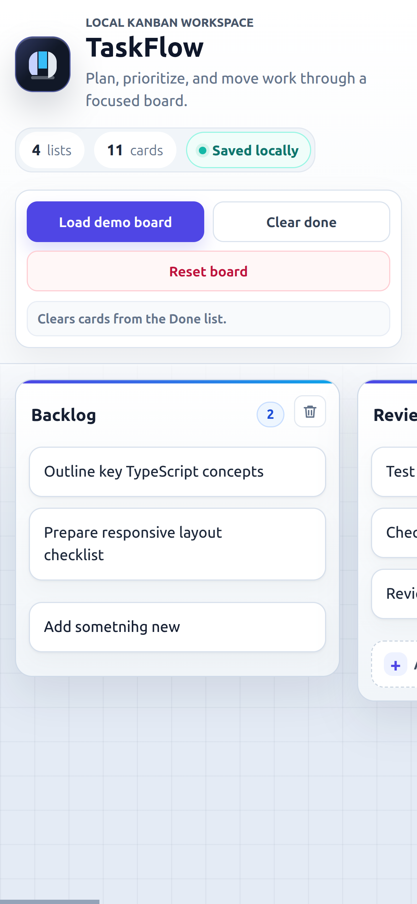

# TaskFlow

**TaskFlow** is a polished Trello-style Kanban board built with **React**, **TypeScript**, **Vite**, **styled-components**, and `@hello-pangea/dnd`.

It started as a course-based Trello clone and was then cleaned up, modernized, and shaped into a portfolio-ready mini product. The project focuses on practical React + TypeScript fundamentals: typed data models, reusable components, custom hooks, Context-based state management, drag-and-drop interactions, localStorage persistence, responsive UI, and product-level polish.

**Live Demo:** https://taskflow-kanban-kappa.vercel.app/

---

## Screenshots

### Desktop board overview

<p align="center">
  
</p>

### Drag-and-drop interactions

<table>
  <tr>
    <td width="50%">
      
    </td>
    <td width="50%">
      
    </td>
  </tr>
</table>

### Mobile layout

<p align="center">
  
</p>

---

## Overview

TaskFlow is a focused Kanban board for planning, tracking, and finishing work.

The app supports a simple workflow:

```text
Backlog -> In Progress -> Review -> Done
```

Users can create lists, create task cards, edit content, reorder lists, move cards between columns, load a demo board, reset the board, and keep their board saved locally in the browser.

The visible product direction is intentionally small and clear:

```text
Plan the work.
Move tasks through the board.
Keep progress saved locally.
```

The goal is not to build a full project-management platform. The goal is to demonstrate a clean, typed React implementation of a polished local Kanban board.

---

## Core Features

### Board and list management

TaskFlow supports:

- creating columns
- editing column titles
- deleting columns
- reordering columns with drag-and-drop
- per-column card counts
- horizontal Kanban layout

### Card management

Cards support:

- creating new cards
- editing card titles
- deleting cards
- reordering cards inside the same column
- moving cards between different columns
- safe long-text wrapping

### Local persistence

Board state is saved in browser `localStorage`, so the board remains available after refresh.

The app also shows a **Saved locally** indicator to make the persistence model clear in the UI.

### Demo board

TaskFlow includes a ready-made demo board so the app is useful immediately after opening it.

The demo board helps with:

- quick review
- screenshots
- testing the workflow
- showing the project without requiring manual setup

### Board actions

The header includes:

- `Load demo board`
- `Clear done`
- `Reset board`

The app also shows board-level stats:

- total lists
- total cards

### Product-style UI polish

The UI was polished beyond the original course clone structure.

Polish includes:

- clear app identity
- product-style header
- board stats
- saved-locally indicator
- improved column styling
- improved card styling
- empty state
- responsive layout
- better microcopy

---

## Demo Workflow

The demo board uses four columns:

```text
Backlog
In Progress
Review
Done
```

The demo cards are written around the project itself, including:

- planning portfolio scope
- practicing TypeScript concepts
- building reusable board components
- connecting drag-and-drop interactions
- checking responsive behavior
- persisting board data locally
- polishing the TaskFlow UI

This makes the demo board useful both as app content and as a portfolio presentation aid.

---

## Clear Done Behavior

The `Clear done` action intentionally uses simple Kanban-style logic.

It clears cards from a column whose title is `Done`, using trimmed, case-insensitive matching.

Examples that work:

```text
Done
done
 DONE 
```

This keeps the project small and avoids adding extra status fields or a more complex workflow model.

A future version could add explicit list or card status metadata, but that is outside the current portfolio scope.

---

## Technical Architecture

TaskFlow uses a small Context-based state layer.

High-level structure:

```text
main.tsx
  BoardProvider
    App
      Column
        Card
```

`BoardProvider` owns the board state and exposes board actions through context.

Components consume state and actions with the `useBoard` hook instead of passing every board action through multiple prop layers.

The app is built around a simple nested data model:

```ts
export interface Card {
  id: string;
  title: string;
}

export interface Column {
  id: string;
  title: string;
  cards: Card[];
}
```

Conceptually:

```text
Column
  └── cards: Card[]
```

This keeps the project easy to reason about while still supporting nested drag-and-drop behavior.

---

## State and Persistence

TaskFlow uses a custom generic `useLocalStorage<T>` hook.

The hook behaves similarly to `useState`, but also persists the value in browser `localStorage`.

Current use case:

```ts
const [columns, setColumns] = useLocalStorage<Column[]>("board", []);
```

The board uses the localStorage key:

```text
board
```

The hook supports the same update style as React state:

```ts
setValue(newValue);
```

or:

```ts
setValue((previousValue) => nextValue);
```

This project uses local-first persistence only. It does not include accounts, backend persistence, cloud sync, or multi-device state.

---

## Drag and Drop

Drag-and-drop behavior is powered by `@hello-pangea/dnd`.

The app supports:

- column reordering
- card reordering inside one column
- moving cards between different columns

The drag result is handled in `App.tsx`.

Pure list update logic lives in `src/utils/listUtils.ts`.

Important utilities include:

- `reorderList<T>`
- `switchCards`
- `addCardToColumn`
- `updateColumnById`
- `updateCardById`
- `deleteColumnById`
- `deleteCardById`

The main mental model:

```text
Column[] goes in
updated Column[] comes out
```

The helper functions avoid direct mutation and return updated board data, which fits React state update patterns.

---

## TypeScript Practice

TaskFlow was used to practice practical TypeScript inside a real React project.

Key TypeScript concepts used in the project:

- typed component props
- interfaces for board data
- generic custom hook `useLocalStorage<T>`
- tuple return type
- `Dispatch<SetStateAction<T>>`
- React Context typing
- typed refs such as `HTMLTextAreaElement`
- typed keyboard events
- generic helper `reorderList<T>`
- utility type `Omit`
- typed drag result with `DropResult`
- styled-components transient props such as `$isEditing`

The project also reinforced broader TypeScript fundamentals such as:

- type inference
- union types
- function parameter and return typing
- `void`
- optional values
- avoiding `any`
- using generics instead of unsafe flexible types
- DOM type assertions where needed

---

## Project Structure

```text
src/
  assets/
    PlusIcon.tsx
    TrashIcon.tsx

  components/
    AddColumnButton/
      AddColumnButton.tsx
      index.ts
      styles.ts

    Card/
      Card.tsx
      index.ts
      styles.ts
      types.ts

    Column/
      Column.tsx
      index.ts
      styles.ts
      types.ts

  context/
    BoardContext.ts
    BoardProvider.tsx
    useBoard.ts
    index.ts

  hooks/
    useClickOutside.ts
    useLocalStorage.ts
    index.ts

  utils/
    listUtils.ts

  demoBoard.ts
  styles.css
  styles.ts
  types.ts
```

Key areas:

```text
src/components/          Board UI components
src/context/             Board state and actions
src/hooks/               Reusable custom hooks
src/utils/               Pure board update helpers
src/demoBoard.ts         Demo board data
src/types.ts             Shared board data types
src/styles.ts            Shared styled-components layout primitives
src/styles.css           Global styles
```

Non-JSX files use `.ts`, while React component files that render JSX use `.tsx`.

---

## Tech Stack

### Runtime

- React
- TypeScript
- styled-components
- @hello-pangea/dnd
- uuid

### Tooling

- Vite
- ESLint
- npm

### Browser persistence

- localStorage

---

## Running Locally

Clone the repository:

```bash
git clone https://github.com/aleksandar-todorovic-dev/taskflow-kanban.git
cd taskflow-kanban
```

Install dependencies:

```bash
npm install
```

Start the development server:

```bash
npm run dev
```

Run lint:

```bash
npm run lint
```

Create a production build:

```bash
npm run build
```

Preview the production build locally:

```bash
npm run preview
```

---

## Validation

The project currently passes:

```bash
npm run lint
npm run build
```

Manual QA confirmed:

- demo board loads correctly
- reset board clears state
- clear done removes cards from the `Done` list
- adding, editing, and deleting columns works
- adding, editing, and deleting cards works
- column drag-and-drop works
- card drag-and-drop works
- moving cards between columns works
- localStorage persistence works after refresh
- responsive layout is usable
- long text wraps safely in cards and columns

---

## MVP Scope

TaskFlow intentionally keeps the scope focused.

Included:

- local Kanban board
- column CRUD
- card CRUD
- drag-and-drop
- localStorage persistence
- demo board
- reset board
- clear done
- board stats
- responsive product-style UI

Not included:

- authentication
- backend persistence
- cloud sync
- multi-device sync
- routing
- card detail modals
- comments
- labels
- due dates
- user accounts
- team collaboration
- advanced project-management workflows

These features are outside the current portfolio MVP scope.

---

## Future Improvements

Possible future improvements:

- make edit controls more keyboard-accessible
- add tests for utility functions
- extract drag-and-drop logic if the app grows
- add optional labels or due dates
- add card detail modal
- add explicit status metadata instead of title-based `Done` detection

These are future ideas, not current features.

---

## What This Project Demonstrates

TaskFlow demonstrates a practical React + TypeScript implementation of a polished local Kanban board.

It shows:

- React component composition
- TypeScript interfaces and typed props
- generic hooks and helper functions
- Context-based shared state
- custom hooks
- immutable nested state updates
- localStorage persistence
- drag-and-drop interaction handling
- styled-components usage
- transient styling props
- responsive Kanban layout
- small-product UI polish
- README/documentation cleanup for portfolio presentation

This project is best positioned as a strong supporting TypeScript project in a portfolio, not as a full project-management SaaS.